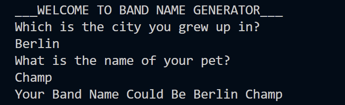

# DAY 1 - WORKING WITH VARIABLES IN PYTHON TO MANAGE DATA

Welcome to Day 1 of the **100 Days of Code - Python Bootcamp** by Angela Yu.

Goal for the day: To build a simple python program that generates a fun band name using the city name and the pet name.

## Concepts Learnt and Practiced
- Use of print() statement
- String Manipulation (String Concatenation)
- Use input with input()
- Variables and naming them

## BAND NAME GENERATOR

