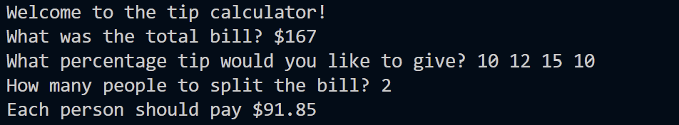

# DAY 2 - UNDERSTANDING DATA TYPES AND HOW TO MANIPULATE STRINGS

Welcome to Day 1 of the **100 Days of Code - Python Bootcamp** by Angela Yu.

Goal for the day: To build a simple python program that calculates how much a person should pay (including the TIP)

## Concepts Learnt and Practiced
- Data Types
- Type Error, Type Checking, and Type Conversion/Type Casting
- Mathematical Operations and Precedence of Operations (PEMDAS)
- Number Manipulation - Data type conversion, round()
- Using Assignment Operators (+=, -=, *=, /=, etc) 
- F-Strings

## BAND NAME GENERATOR

